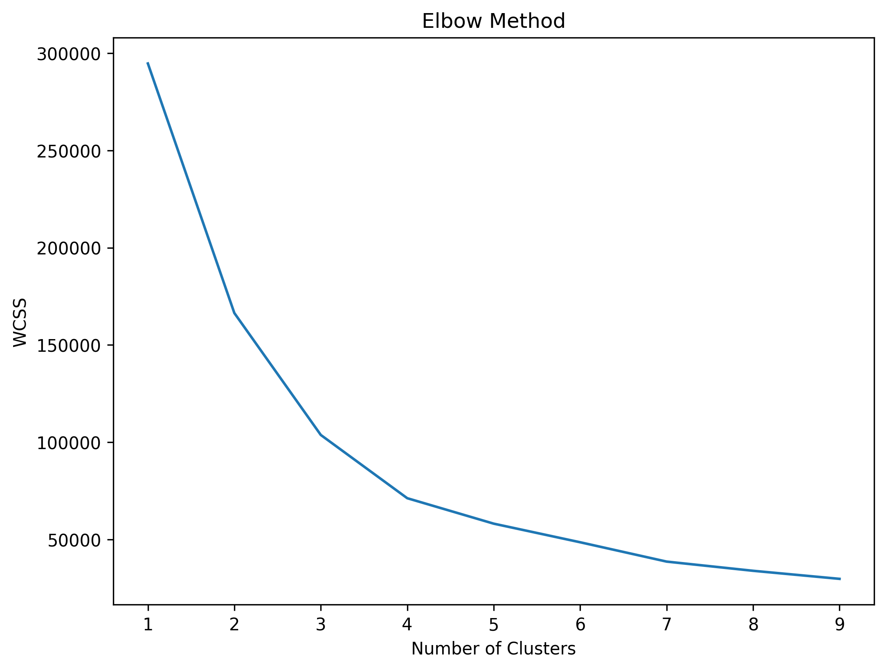
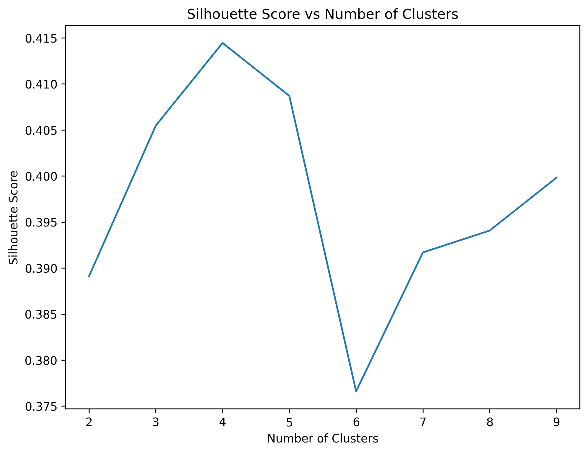
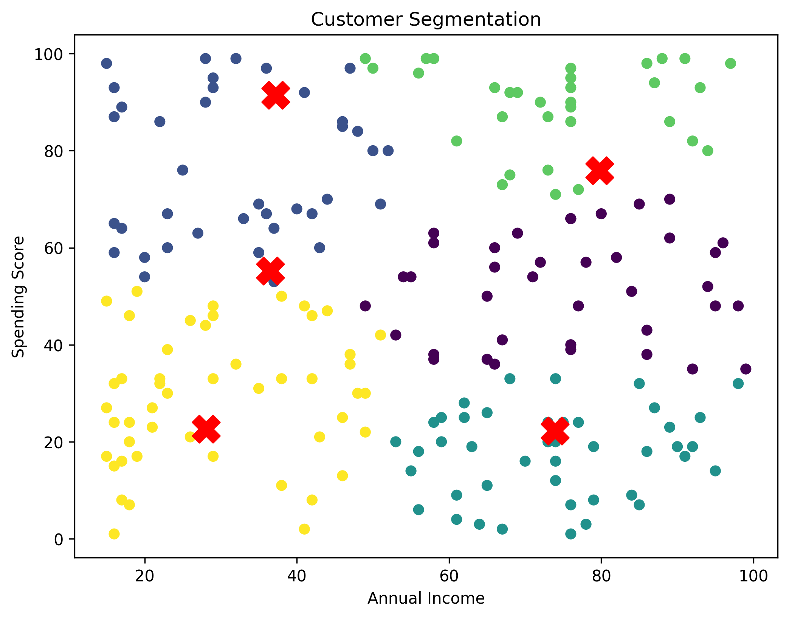
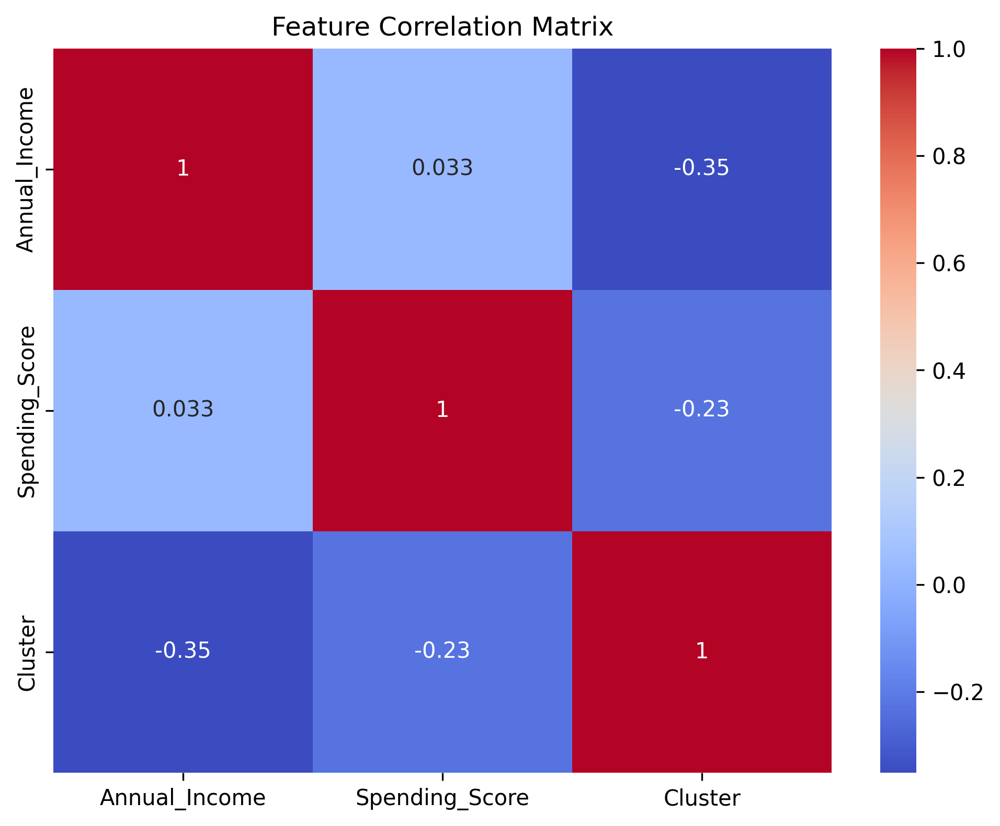
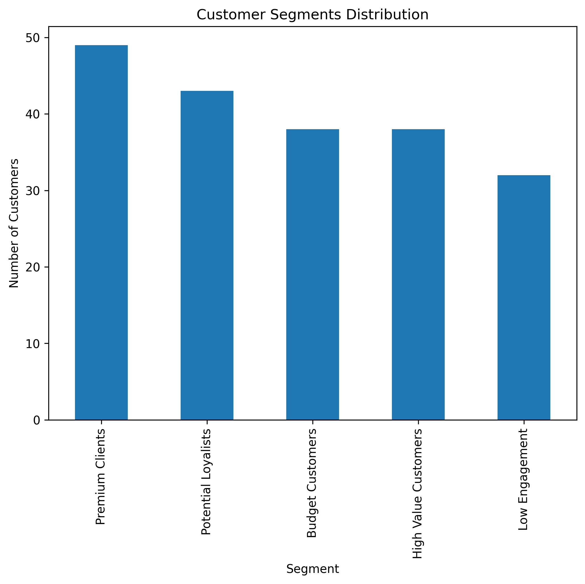

# Customer Segmentation using Machine Learning (K-Means)

---

# Project Overview

Customer segmentation is a key technique used in data-driven marketing and business analytics.

In this project, machine learning is used to identify groups of customers with similar purchasing behavior using the K-Means clustering algorithm.

The goal of the analysis is to help businesses better understand their customers and support data-driven decision making in marketing strategies.

Customer segmentation enables companies to:

- identify high-value customers
- personalize marketing campaigns
- improve customer retention
- optimize marketing budgets
- increase overall customer lifetime value

The clustering in this project is based on two main features:

- Annual Income
- Spending Score

---

# Business Problem

Companies often have large customer bases, but not all customers behave the same way.

Without segmentation, businesses risk:

- targeting the wrong audience
- wasting marketing budgets
- failing to identify valuable customers
- offering irrelevant promotions

Customer segmentation allows businesses to group customers based on behavior and apply more effective marketing strategies.

---

# Project Goals

The objectives of this project are:

- apply unsupervised machine learning for customer segmentation
- identify patterns in customer behavior
- visualize customer clusters
- evaluate clustering quality
- generate actionable business insights

---

# Skills Demonstrated

This project demonstrates the following skills:

- Exploratory Data Analysis (EDA)
- Data Visualization
- Unsupervised Machine Learning
- Customer Segmentation
- Feature Analysis
- Model Evaluation
- Business Insight Generation

---

# Technologies Used

The project was implemented using the following tools:

- Python
- Pandas
- NumPy
- Matplotlib
- Seaborn
- Scikit-learn
- Jupyter Notebook

---

# Machine Learning Method

This project uses the K-Means clustering algorithm, a popular unsupervised machine learning technique.

K-Means groups data points into clusters based on similarity.

Customers within the same cluster share similar characteristics such as income level and spending behavior.

---

# Determining the Optimal Number of Clusters

Choosing the correct number of clusters is important.

Two evaluation techniques were used:

- Elbow Method
- Silhouette Score

These methods help determine the optimal number of clusters.

---

# Elbow Method

The Elbow Method evaluates clustering performance using Within Cluster Sum of Squares (WCSS).

The optimal number of clusters is where adding additional clusters no longer significantly improves the model.

---

# Silhouette Score

Silhouette Score measures how well each data point fits within its cluster compared to other clusters.

Higher values indicate better cluster separation.

---

# Customer Segmentation Visualization

Using the optimal number of clusters, customers are grouped based on Annual Income and Spending Score.

Each color represents a different customer segment identified by the clustering algorithm.

---

# Feature Correlation

The correlation matrix helps analyze relationships between the variables used in the clustering analysis.

---

# Customer Segment Distribution

This chart shows how customers are distributed across the different segments.

---

# Customer Segments Identified
The clustering analysis identified several types of customers:

### Premium Clients
Customers with high income and high spending behavior.

These customers represent the most valuable segment.

### High Value Customers
Customers with strong purchasing behavior.

They contribute significantly to business revenue.

### Potential Loyalists
Customers with strong potential to become high-value customers.

### Budget Customers
Customers with lower income but moderate spending behavior.

They may respond well to discounts and promotions.

### Low Engagement Customers
Customers with low spending activity.

These customers may require re-engagement campaigns.

---

# Key Business Insights

The clustering analysis provides several important insights:

- High-value customers should be targeted with premium offers.
- Potential loyalists represent opportunities for revenue growth.
- Budget customers may respond well to discount campaigns.
- Low engagement customers may require retention strategies.

Customer segmentation helps businesses create more efficient and targeted marketing strategies.

---

# Project Structure
customer-segmentation-ml-project
│
├── customer-segmentation-project
│
│   ├── images
│   │   ├── customer_segments.png
│   │   ├── elbow_method.png
│   │   ├── silhouette_score.png
│   │   ├── correlation_heatmap.png
│   │   └── segment_distribution.png
│   │
│   ├── notebooks
│   │   └── customer_segmentation_analysis.ipynb
│   │
│   └── requirements.txt

---

# How to Run the Project

Clone the repository:
git clone https://github.com/T0r0s68/customer-segmentation-ml-project.git

Install dependencies:
pip install -r requirements.txt

Open the notebook:
notebooks/customer_segmentation_analysis.ipynb

---

# License

This project is licensed under the MIT License.
